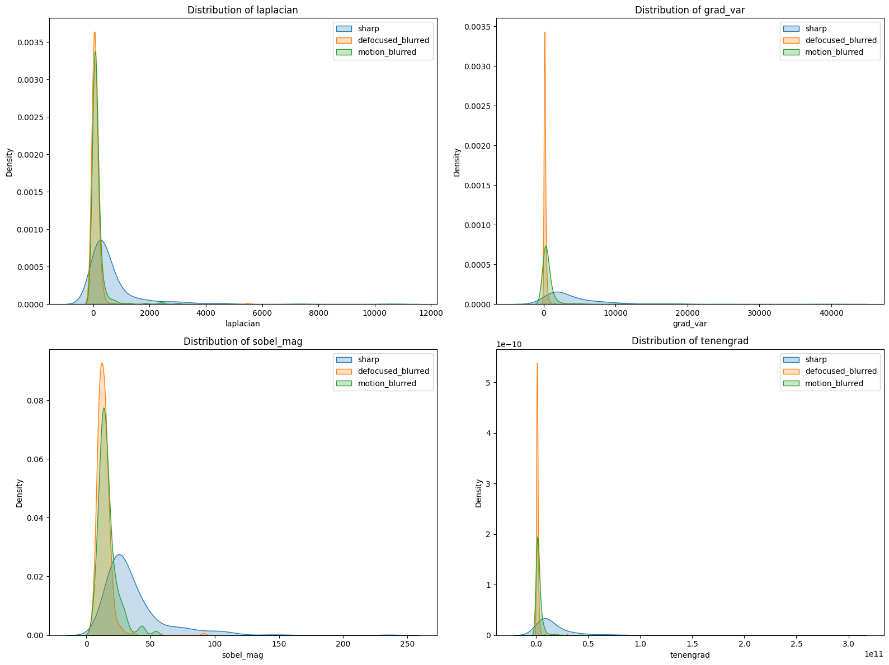

#  Image Blur Detection Project 

##  Student Information
- **Name:** Asala Abdel-Naim Abu Gharaara  
- **Major:** Data Science & Artificial Intelligence  
- **University:** University College of Applied Sciences 
- **Course:** Digital Image Processing 
---

##  Project Overview
This project focuses on detecting whether an image is **sharp** or **blurred** using
classical image processing techniques combined with a machine learning classifier.

Instead of relying on deep learning models, this project extracts **handcrafted features**
related to image sharpness and uses them to train a classifier that distinguishes between
sharp and blurred images.

---

##  Dataset Source
The dataset used in this project is the **Blur Dataset** from **Kaggle**.

 **Important Note:**  
The dataset was **not downloaded manually**.  
Instead, it was accessed directly using Kaggle’s official API through Python code
(`kagglehub`), and the experiments were performed on the dataset path provided by Kaggle.

Dataset categories:
- `sharp`
- `motion_blurred`
- `defocused_blurred`

 **Dataset Details:**
- Total images: **1050**
- Images per class: **350**
- Labels used for classification:
  - `sharp` → 0  
  - `motion_blurred`, `defocused_blurred` → 1  

##  Model Evaluation Results (Unified Analysis)

### Confusion Matrix

**Analysis:**  
The confusion matrix provides a clear and detailed evaluation of the blur detection model performance.  
It shows that the model successfully classifies most **blurred images** with high accuracy, indicating strong sensitivity to blur-related features.  
A small number of **sharp images** are misclassified as blurred, which can be attributed to low contrast, weak edges, or smooth regions that resemble blur characteristics.  
Overall, the confusion matrix confirms that the model is reliable and effective for binary blur classification.

---

### Feature Distributions

**Analysis:**  
This figure illustrates the distributions of the extracted image features used in the classification process, including **Laplacian Variance**, **Gradient Variance**, **Sobel Magnitude**, and **Tenengrad**.  
The plots clearly show that sharp images tend to have higher values for edge-based features, while blurred images exhibit lower responses due to the loss of high-frequency information.  
Among all features, **Laplacian Variance** and **Tenengrad** demonstrate the strongest separation between sharp and blurred images, highlighting their effectiveness for blur detection.  
These visual results support the quantitative performance metrics and justify the feature selection strategy adopted in this project.

---

### Overall Interpretation

The combination of visual analysis and numerical evaluation confirms that the proposed feature-based approach, together with an MLP classifier, provides a robust and efficient solution for image blur detection.  
The results validate that classical image processing features can achieve strong performance without relying on complex deep learning architectures.

##  Preprocessing
- Images were loaded directly from the Kaggle dataset directory.
- All images were converted to **grayscale**.
- No resizing was applied since the dataset images were

## Final Notes
This project demonstrates that classical image processing features,
when carefully selected and combined with a machine learning model,
can achieve strong performance in image blur detection tasks without
the need for deep learning. 
